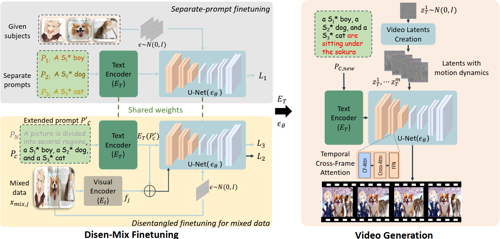

# Project Page for VideoDreamer
We will release our code and our paper here soon. Currently the project page is available at [VideoDreamer](https://videodreamer23.github.io/).

## Introduction
This repository is for our work **VideoDreamer: Customized Multi-Subject
Text-to-Video Generation with Disen-Mix Finetuning**. Our work aims to generate videos for the user-customized multiple subjects, according to the user-provided text descriptions. The VideoDreamer framework is shown in the following figure. More demos are given in the project page.

